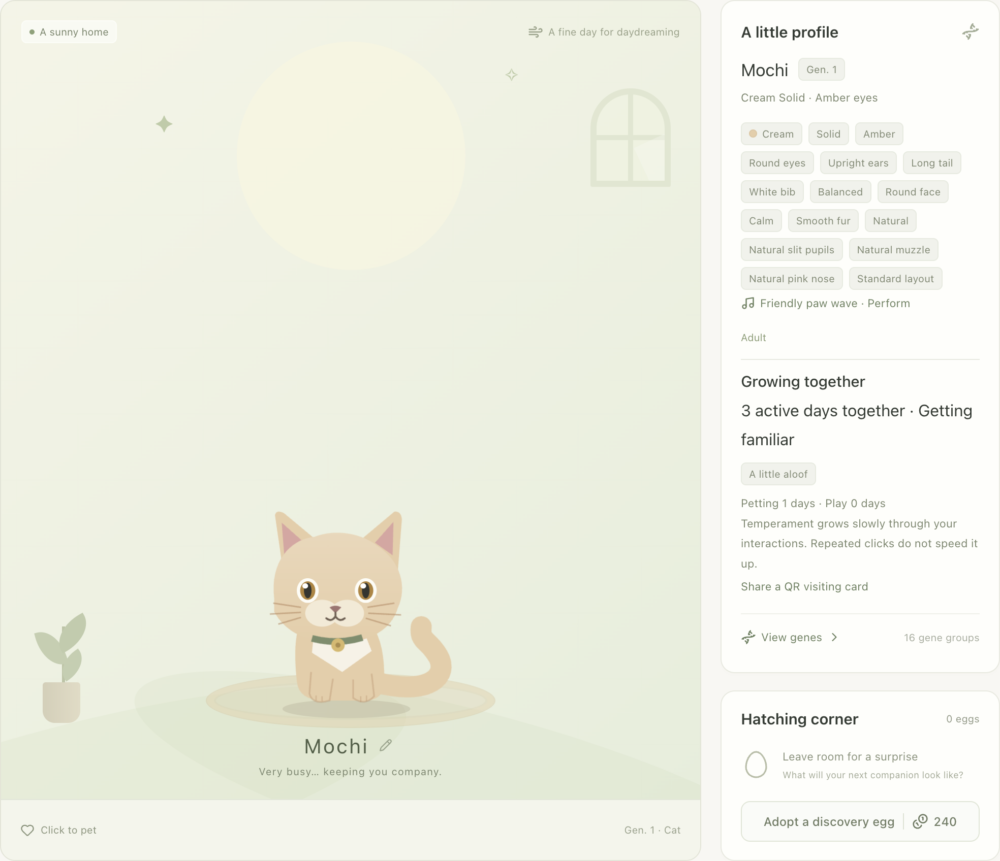

<a id="pawprint"></a>

# Pawprint — Your work has company

**A little desktop cat. A better way back to your Codex work.**

[Download v0.13.0](https://github.com/huangbinjie/pawprint/releases/tag/v0.13.0) · [Website](https://huangbinjie.github.io/pawprint/) · [Chinese](README.zh-CN.md)

Pawprint is an independent desktop companion for Windows x64 and Apple silicon Macs. It keeps useful work shortcuts beside a cat that grows with your local Codex activity. No API key or extra model requests are needed for the pet, reminders or games.


## Small paws, useful shortcuts

| When… | Your companion helps you… |
| --- | --- |
| You return to work | Hover over the cat and jump to your active or pinned Codex chat. Recent chats show real titles and project names. |
| Codex needs a decision | Spot the amber bell for a supported approval or question request, then return to that chat. Pawprint never approves or answers for you. |
| You leave a task unfinished | Save a short next-step bookmark. Your note appears beside the cat when you return. |
| A reply finishes while you are away | Keep an unread marker until you open or mark the chat as read. Choose a gentle sound, system notification or quiet reminders. |
| You want a small break | Play a short game, build practice and bond, and unlock toys, keepsakes and room decorations. |

A reply ending is treated as a reply ending. Running or uncertain parallel tasks suppress completion celebrations.

## A companion of your own

- **Inherited looks:** Coat, eyes, ears and tail come from genes. Browse trait odds, hatch eggs and breed new combinations.
- **Quiet company:** Wandering, a toy ball, cursor glances and occasional greetings. Normal controls appear on hover; the bell stays visible while a request needs you. Click targets remain usable at every pet scale.
- **A room that grows with it:** Ball, feather and hide-and-seek games build practice and bond. The first three successful rounds per cat each day can earn growth; play and room progress are saved locally.
- **Effort into growth:** Local token usage can earn capped pet-coin rewards. Estimated costs are API equivalents, not your subscription bill or cash assets.
- **Meet other companions:** Share a QR visiting card, or connect nearby homes on your LAN for visits and breeding. Both people choose to connect.



## Ready on first launch

New installs start in **English** with local usage, quota, session feedback, broad topic labels and quiet reminders enabled. Recent chat metadata loads immediately, without replaying old reply events. Your existing language, reminder choice and explicit opt-outs are preserved on upgrade.

Adopt your first egg in the home, then hover over your cat to find its work shortcuts. Pin a focus chat if you want the return button to keep pointing at the same task.

On macOS, Pawprint prepares its seven clearly labeled hooks when Codex data is found. **Review and trust the “Pawprint ·” rows in your client** to enable approval alerts. Existing hook rules are preserved and backed up. Supported structured local questions also provide reminders without hook trust. Native hook setup is currently macOS-only; chat return requires a compatible Codex desktop client.

## Usage close at hand

See 30-day token history, daily priced costs and per-model input, cache-read, cache-write and output details. Remaining five-hour and weekly quota comes from recent local snapshots; it is not a live account query. Mac shows quota in the menu bar, Windows in the tray menu.

The price catalog comes from [models.dev](https://models.dev/), refreshes automatically and retains an offline cache. API-key models used through Codex are matched by provider and model ID. Unknown or incomplete pricing stays visible as pending. Priced usage can earn today's rewards; repeated refreshes do not duplicate rewards, and incomplete or conflicting usage records pause redemption.

## Install

- [Windows 10/11 x64 installer](https://github.com/huangbinjie/pawprint/releases/download/v0.13.0/Pawprint-0.13.0-win-x64-setup.exe)
- [Apple silicon Mac archive](https://github.com/huangbinjie/pawprint/releases/download/v0.13.0/Pawprint-0.13.0-mac-arm64.zip)
- [Release notes and SHA-256 files](https://github.com/huangbinjie/pawprint/releases/tag/v0.13.0)

Verify the accompanying checksum. Windows beta builds are unsigned; run the installer and retain your existing app data. Mac beta builds have a complete ad-hoc bundle signature but are not Developer ID signed or notarized. Move Pawprint to Applications. If macOS cannot verify the developer, choose Done, then **System Settings → Privacy & Security → Open Anyway**. If macOS says damaged, stop and report that build. See [Mac signing and installation](docs/RELEASE_SIGNING.md) and [Windows support](docs/WINDOWS.md).

## Local by design

Pets, bookmarks, rooms and usage data stay in your local profile. Work helpers read local Codex records; optional broad topic labels classify new messages locally. Reminder journals do not retain question text, tool arguments or transcripts. Price catalogs and update checks use their existing network sources. Nearby visits are optional and use your LAN.

API chat, local model management and client voice shortcuts are retired in v0.13.0. Previous provider files are preserved and no longer loaded. See the [retirement note](docs/ASSISTANT.md).

Pawprint is an independent app and is not affiliated with OpenAI. It does not read browser ChatGPT conversations or make decisions on your behalf.

## Develop

Requires Node.js 22.12+.

```sh
npm ci
npm run dev
```

`npm test` runs core checks; `npm run test:ui` runs desktop interaction checks. Use `npm run package:local` for an ad-hoc signed Apple silicon build, or `npm run package:win` on Windows for an x64 installer. Version tags build the Mac archive and Windows installer; publishing waits for both builds and their checks. Changes in `site/` deploy through GitHub Pages.

See the [changelog](CHANGELOG.md) for release history.
